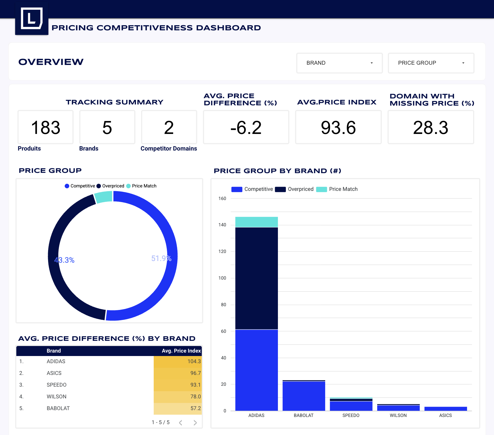
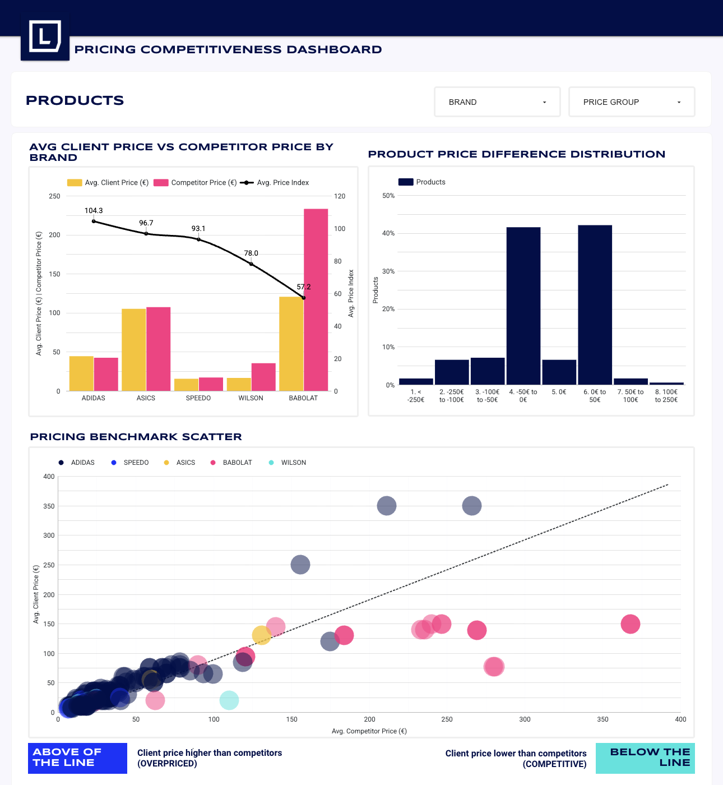

# 📊 Custom Pricing Competitiveness Dashboard

The goal of this project is to **design the end-to-end solution to a client**, from data extraction to dashboard creation. The final output will allow the client to self-serve answers to recurring questions about how
their prices compare to competitors in the market.


  
## Exploring Lineage

```sql
dbt docs generate
dbt docs serve
```

### The documentation interface allows you to:
- Visualize data lineage (upstream sources and downstream dependencies)
- Explore model relationships
- Access column-level metadata and descriptions
- Review tests and data quality checks
- Understand business logic implemented in each model

### In particular, the Data Model section provides a clear overview of:
- The list of analytical tables and views 
- Their business purpose and intended use
- Key metrics and transformations applied
- This ensures full transparency of the transformation layer and makes it easy for stakeholders and analysts to understand how data is structured and how each model should be used.

## Exploring Dashboard

Check it out here (there is more)



<p align="center">
  
  &nbsp;&nbsp;
  
</p>


